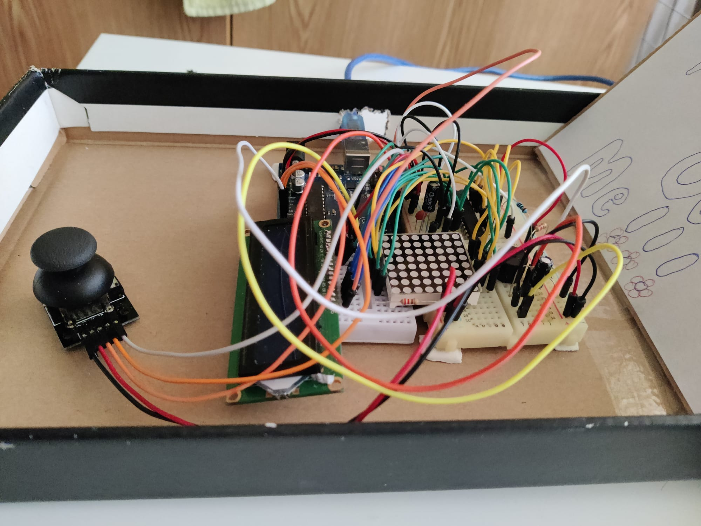
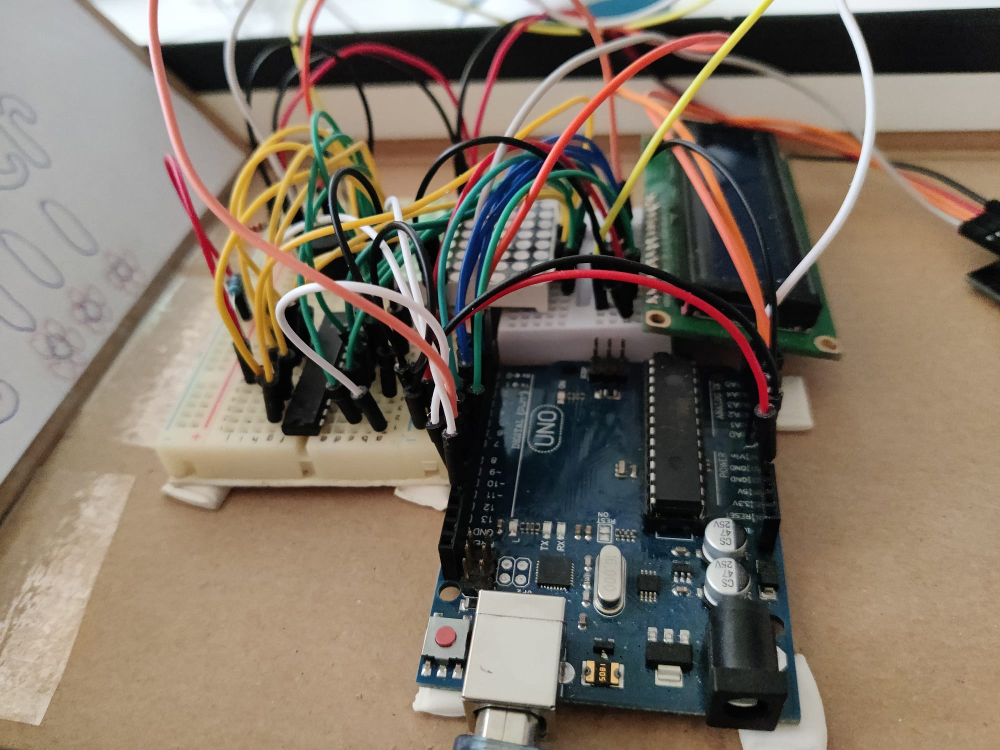
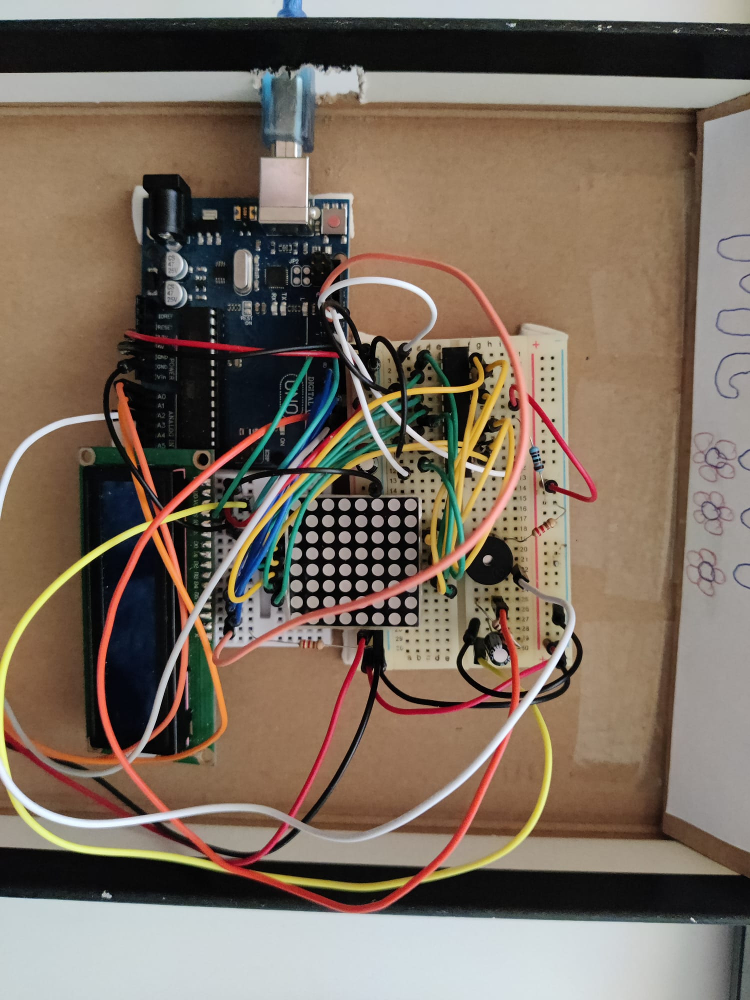
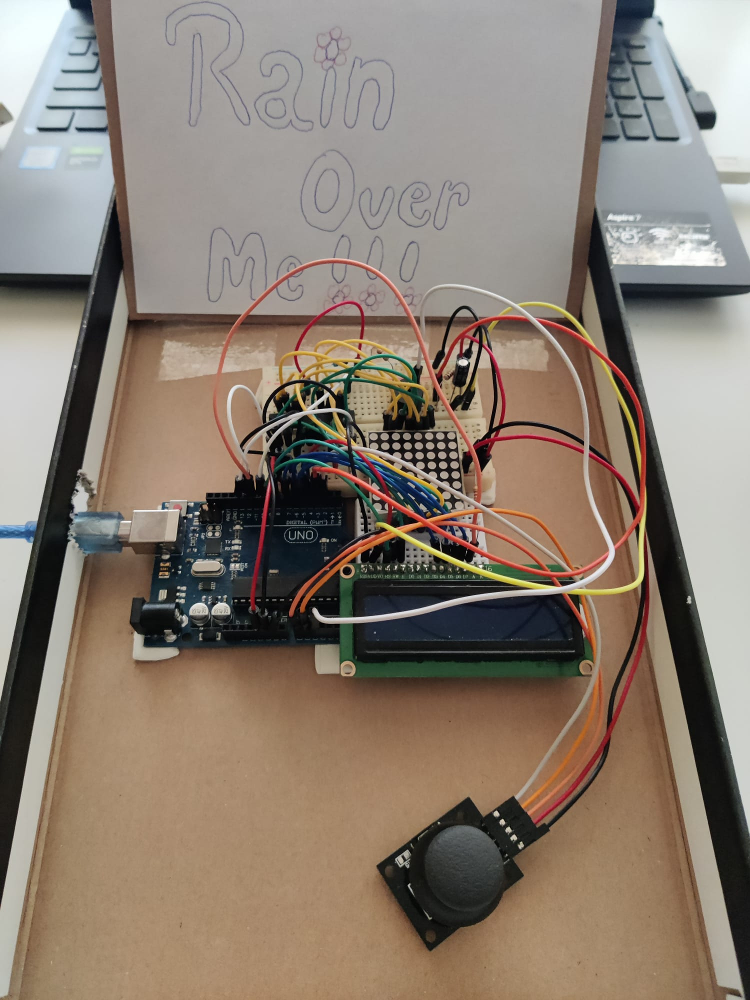

# **Rain Over Me**
This is the midterm project for the Introduction to Robotics course taken in the 3rd year at the Faculty of Mathematics and Computer Science, University of Bucharest.

The project involves making a game on a matrix of LEDs and an LCD screen using a joystick and more.

## **Contents**
TBA

---

## **Technical Task.**
### **Menu Requirements.**
1. When powering up the game, a greeting message should be shown for
a few moments  

2. Should contain roughly the following categories:  
    a) **Start game:** starts the initial level of your game    

    b) **Highscore**:
    - Initially the high score table is empty (full of zero score)
    - Update it when the game is done. Highest possible score
should be achieved by starting at a higher level
    - Save the top 5+ values in EEPROM with name and score  

    c) **Settings**:  
    - ***Enter Name.*** The name should be shown in highscore. Maybe
somewhere else, as well  
    - ***Starting Level.*** Set the starting level value. The idea is to
be able to start from a higher level as well. Can be replaced
with difficulty  
    - ***LCD Contrast Control.*** (optional, it replaces the potentiometer). *Save it to EEPROM*
    - ***LCD Brightness Control.*** (mandatory, must change LED wire
that’s directly connected to 5V). *Save it to EEPROM*
    - ***Matrix Brightness Control.*** (see function ```setIntesnity()``` from the
```ledControl``` library). *Save it to EEPROM* 
    - ***Sounds.*** ON or OFF. *Save it to EEPROM*  
    - ***Extra stuff.*** can include items specific to the game mechanics
or other settings such as chosen theme song etc. Again, save
it to EEPROM  

    d) **About**: Should include details about the creator(s) of the game.
At least game name, author and github link or user  

    e) **How to play**: Short and informative description

3. While playing the game, display all relevant info. E.g. *Lives*, *Level*, *Score*, *Time*, *Player Name* etc.

4. Upon game ending.  
    a) **Screen 1**. a message such as ”Congratulations on reaching level/score X”, ”You did better than y people.” etc. Switches to screen 2
upon interaction (button press) or after a few moments    
    b) **Screen 2** display relevant game info: score, time, lives left etc.
Must inform player if he/she beat the highscore. This menu should only be closed by the player, pressing a button.


### **Game Requirements.**  
- Minimal components: a LCD, a joystick, a buzzer and the led
matrix  
- Add basic sounds to the game (when ”eating” food, when
dying, when finishing the level etc). Extra: add theme songs  
- It must be intuitive and fun to play  
- It must make sense in the current setup. Study the idea of a panning
camera - aka the 8x8 led doesn’t need to be the entire map. It can
only be the current field of view of the player  
- The levels must progress dynamically. Aka the level difficulty, score
and other properties should be a function of the level number or time.
However, the challenge here is for it to grow in a playable way - not
too easy for a long time so it becomes boring, not too hard too fast
so it’s not attractive. Also, it’s nice to have an ending, a final level,
a boss etc. It shouldn’t necessarily go on forever, but that’s fine,
though

---

## **Components.**
- 1 x Arduino UNO
- 2 x breadboards
- 1 x Joystick
- 2 x Electrical Condensators
- 1 x Ceramic COndensator
- 1 x Buzzer
- 1 x LED Matrix
- 1 x LCD Screen
- 1 x Driver
- resistors and wires (according to logic)

---

## **Pictures of the setup.**

|  |  | 
|:-------------:|:-------------:|
|  |  |

---

## **Video showcasing functionality.** [here](https://youtu.be/E_nb-XMdPQE) TBA

---

**Game Description**
And since global warming is an increasingly common phenomenon in our lives, I thought the theme of the game would be this:

The player is a plant in the middle of a drought. Try to stay alive by catching the few raindrops that fall from the sky. For every drop caught, he earns points that keep him hydrated and alive, and for every missed raindrop, he gets closer and closer to death.

Hence the name of the *Rain Over Me* project. A name that is also inspired by Pit Bull's famous song, even if the theme of the game has nothing to do with the message of the song :))

## **Backstory.**
The idea of the game started from a simple internet search for project ideas. I found a simpler version of a game where you had to catch a light passing through the matrix using a potentiometer. I found the idea interesting, but a bit simplistic because the potentiometer was much more accurate in movement and then easy to control. So I combined this game with some superpowers, replaced the potentiometer with a joystick, and suddenly the game became much more challenging.

## **How to play.**
At the bottom of the matrix there will be a dot always on. It can be moved left or right with the joystick. You have to catch as many raindrops falling from above as possible. For every drop you catch you will get extra Drops, but for every drop you miss you will lose Drops depending on the difficulty you are on. At five drops caught you will get a powerup that will increase your player to catch more drops. This can be activated with a click.

### **Process explanation.** ([code](./RAIN_OVER_ME/RAIN_OVER_ME.ino))
TBA


 
